# Project Details

Basic Hello world project for connecting a TFT display

# ST7735 1.8" Display - Pin Connection Reference

## Overview

Using **ESP-IDF's built-in `esp_lcd` component** (recommended for ESP-IDF v5.0+).
No custom driver needed - framework handles all hardware communication.

## Pin Definitions

| Function                | ESP32 GPIO | Pin Name     | Purpose                     |
| ----------------------- | ---------- | ------------ | --------------------------- |
| **SPI Bus**             |            |              |                             |
| SDA (MOSI)              | GPIO 11    | TFT_MOSI_PIN | Serial data input (DIN)     |
| SCK (SCL)               | GPIO 12    | TFT_CLK_PIN  | Serial clock (SCL)          |
| **Display Control**     |            |              |                             |
| CS (Chip Select)        | GPIO 16    | TFT_CS_PIN   | Display chip select         |
| A0 (DC - Data/Command ) | GPIO 33    | TFT_DC_PIN   | Command (LOW) / Data (HIGH) |
| RESET (RST)             | GPIO 18    | TFT_RST_PIN  | Display reset line          |
| LED (BL - Backlight)    | GPIO 9     | TFT_BL_PIN   | Backlight control           |
| **Power**               |            |              |                             |
| VCC                     | 3.3V       |              | Display power supply        |
| GND                     | GND        |              | Ground                      |

## SPI Controllers

Most ESP32 chips have multiple hardware SPI controllers.

| Controller | Purpose                                                  |
| ---------- | -------------------------------------------------------- |
| SPI0       | Internal flash memory                                    |
| SPI1       | Internal flash/PSRAM (not for user peripherals)          |
| SPI2_HOST  | User-accessible SPI bus                                  |
| SPI3_HOST  | Another user-accessible SPI bus (on many ESP32 variants) |

We use `SPI2_HOST` to communicate with the display

## Wiring Diagram

