# Project Details

Use a `MPR121` capacitive touch 3x4 matrix keypad and log the touch events.

# ST7735 1.8" Display - Pin Connection Reference

## Overview

Refer to [Pin Diagram](../002-tft-display/README.md#pin-definitions) and [Font setup](../002-tft-display/README.md#enabling-fonts)

## Wiring Diagram

