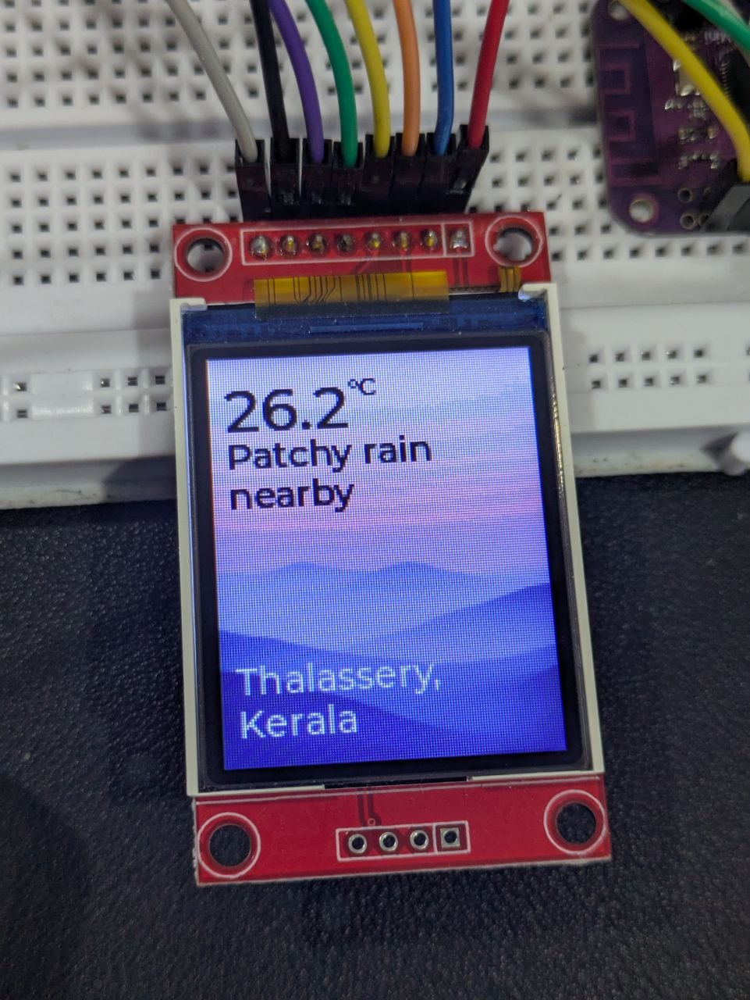

# Project Details

Connect ESP32 to a Wifi, get json data from an api and parse it,
display it in the tft screen and use the `MPR121` 3x4 keypad to control the screen scroll.

## Prerequisites

Setup `.envrc` file with the Wifi credentials

```bash
export WIFI_SSID="home"
export WIFI_PASSWORD="home-wifi-password"
```

# Pin Connection Reference

## Overview

Refer to [Pin Diagram](../002-tft-display/README.md#pin-definitions) and [Font setup](../002-tft-display/README.md#enabling-fonts)

## Wiring Diagram


# UI Preview


