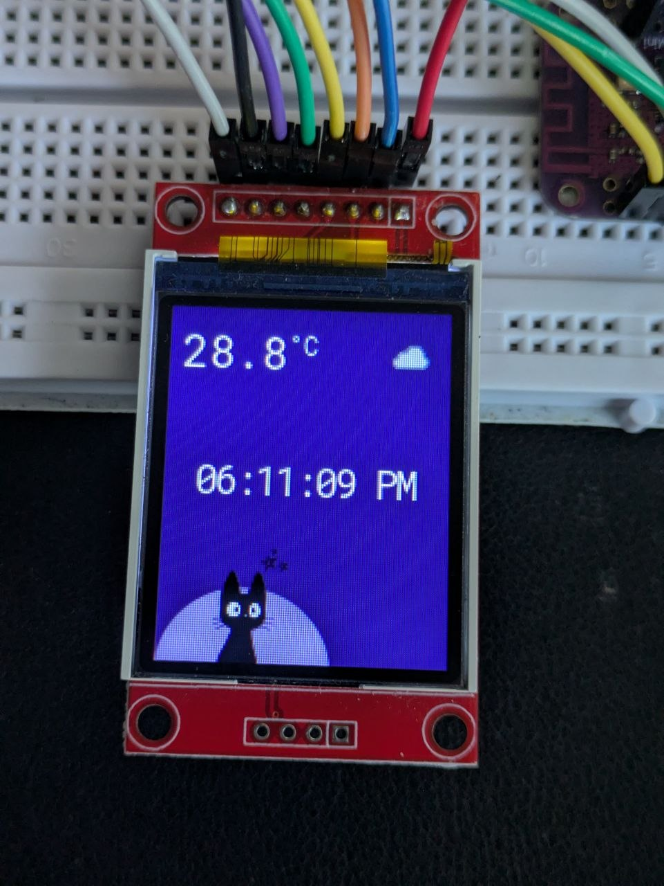

# Project Details

Connect ESP32 to a Wifi, sync with ntp (already done previously when [setting up wifi](../005-wifi/README.md))
display the live time in the tft screen using lvgl ui components.

## Prerequisites

### Setup `.envrc` file with the Wifi credentials

```bash
export WIFI_SSID="home"
export WIFI_PASSWORD="home-wifi-password"
```

### Enable filesystem in `lv_conf.h`

Enable it for loading images directly from flash. Enable png decoder as well.

```c
// enable file system
#define LV_USE_FS_POSIX 1
#define LV_FS_POSIX_LETTER 'A'
#define LV_FS_POSIX_PATH "/data"

// enable png decoder
#define LV_USE_LODEPNG 1
```

### Add a partition for data

Add this row at the end of the `partitions.csv` file

```csv
# Name,   Type, SubType, Offset,  Size, Flags

storage,  data, spiffs,         , 1M,
```

in `main/CMakeLists.txt` add this line to flash the folder into the storage partition.

```c
spiffs_create_partition_image(storage "assets" FLASH_IN_PROJECT)
```

# Pin Connection Reference

## Overview

Refer to [Pin Diagram](../002-tft-display/README.md#pin-definitions) and [Font setup](../002-tft-display/README.md#enabling-fonts)

## Wiring Diagram


# UI Preview


